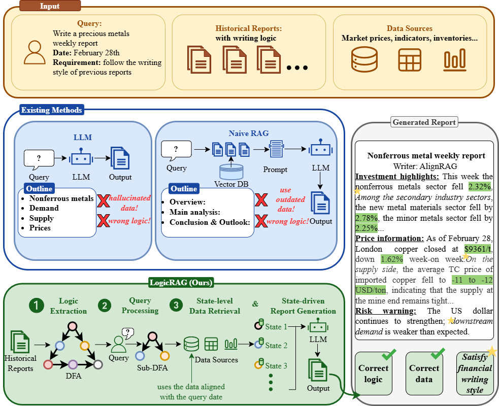

# LogicRAG

Logic-Driven Retrieval-Augmented Generation for Financial Document Generation

---

## Overview

Generating domain-specific documents requires not only retrieving relevant facts, but also following the reusable writing logic that governs how professional reports are organized. This is especially important for financial research report generation, where the generated document must respect institution-specific section order, data usage patterns, and discourse conventions.

To address this challenge, we introduce a new problem named **Logic-Driven Document Generation Problem (LDP)**, where the generated document should be consistent with the writing paradigm of sample documents while accurately grounding numerical values in external data sources. To solve LDP, we propose **LogicRAG**, which represents reusable writing logic in historical documents as a deterministic finite automaton (DFA). Each state corresponds to a discourse segment with a stable semantic function, and state transitions describe the organizational order among these segments. During generation, LogicRAG extracts a task-specific sub-automaton according to the user query, retrieves the required state-level data, and generates the final report state by state.

We further construct and release **FinLDP-Bench**, a financial benchmark dataset for logic-driven document generation. FinLDP-Bench covers five representative categories of financial analyst reports and supports systematic evaluation of logic consistency, data sufficiency, and numerical accuracy.

---

## 1. Motivation

Domain-specific document generation requires not only retrieving relevant facts but also strictly following the writing logic of a specific institution. Financial research report generation is a typical example of this challenge. For example, when the user query is **write a precious metals research report for March 2, 2025**, the system must determine which market indicators should be used, how the report sections should be ordered, and how adjacent paragraphs should maintain coherent analysis.

Traditional RAG methods often fail because they mainly retrieve content based on semantic similarity. They may find locally relevant facts, but still miss the institution-specific writing order, omit required data fields, or mix evidence from inconsistent time ranges. This motivates the Logic-Driven Document Generation Problem and the development of LogicRAG.



Figure 1: Motivation of logic-driven financial document generation.

---

## 2. Method

LogicRAG is a logic-driven RAG framework that transforms document generation from content-centric retrieval into writing-logic-based matching and execution.

The framework consists of three stages:

1. **Document Logic Extraction**  
   LogicRAG extracts state sequences from sample documents, identifies reusable discourse states shared across reports, and constructs a global DFA that represents the institution-specific writing logic.

2. **Query Processing**  
   Given a user query, LogicRAG matches the query intent against the global state index, selects task-relevant states, and extracts a connected sub-automaton that covers the required writing logic.

3. **Generation**  
   LogicRAG retrieves state-level data from heterogeneous data sources, generates report segments along the transition order of the sub-automaton, and passes a brief summary between adjacent states to maintain local coherence without accumulating the full generation history.


Figure 2: Overall framework of LogicRAG.

---

## 3. FinLDP-Bench

**FinLDP-Bench** (Financial Logic-Driven Document Generation Benchmark) is a financial benchmark dataset for logic-driven document generation. The dataset covers five representative categories of financial analyst reports and is organized into structured records with predefined fields.

Detailed statistics of the FinLDP-Bench categories are shown in Table 1.

| Subset | #Rep. | AvgTok | MaxTok | AvgF | MaxF | AvgP | Date Range | Institution |
|---|---:|---:|---:|---:|---:|---:|---|---|
| Agriculture | 100 | 637.1 | 884 | 64.7 | 83 | 4.00 | 2017.04-2026.01 | Pacific Securities Co., Ltd. |
| Cotton | 80 | 291.8 | 424 | 51.7 | 88 | 4.80 | 2023.11-2026.01 | CMB Futures Co., Ltd. |
| Macro | 25 | 354.4 | 422 | 52.8 | 64 | 6.75 | 2025.07-2026.01 | Ping An Securities Co., Ltd. |
| NonFerrous | 150 | 397.0 | 507 | 36.1 | 55 | 3.53 | 2021.01-2025.12 | Soochow Securities Co., Ltd. |
| ETF | 60 | 204.9 | 287 | 28.3 | 37 | 5.59 | 2024.04-2026.01 | Maigao Securities Co., Ltd. |
| **Total** | **415** | **404.2** | **884** | **45.9** | **88** | **4.38** | **2017.04-2026.01** | -- |

Table 1: Statistics of FinLDP-Bench, including the number of reports, text length, numerical-field density, paragraph count, temporal coverage, and source institution of each subset.

---

## 4. Main Results

We compare LogicRAG with representative retrieval-augmented generation methods and strong LLM baselines, including NaiveRAG, Self-RAG, ITER-RETGEN, RAG-Fusion, GraphRAG, HeteRAG, DeepSeek-V3, Qwen2.5-Max, GPT-4o, and Doubao 2.0. LogicRAG achieves the best overall performance across all evaluation metrics.

| Methods | Fluency | Consistency | ACC | BLEU-P | ROUGE-L | F1 |
|---|---:|---:|---:|---:|---:|---:|
| NaiveRAG | 42.5 | 42.0 | 15.3 | 17.8 | 26.1 | 21.1 |
| Self-RAG | 50.7 | 55.8 | 20.2 | 25.1 | 31.0 | 27.7 |
| ITER-RETGEN | 43.9 | 46.4 | 19.8 | 19.9 | 32.6 | 24.7 |
| RAG-Fusion | 50.5 | 48.2 | 17.3 | 23.9 | 38.3 | 29.4 |
| GraphRAG | 54.2 | 53.3 | 24.9 | 24.9 | 36.2 | 29.5 |
| HeteRAG | 54.2 | 53.6 | 20.3 | 29.3 | 38.3 | 33.2 |
| DeepSeek-V3 | 48.0 | 47.7 | 19.3 | 8.8 | 15.0 | 11.1 |
| Qwen2.5-Max | 50.3 | 45.0 | 21.2 | 11.8 | 20.5 | 15.0 |
| GPT-4o | 50.7 | 54.5 | 29.9 | 12.8 | 23.7 | 16.6 |
| Doubao 2.0 | 47.2 | 47.5 | 17.6 | 15.4 | 23.8 | 18.7 |
| **LogicRAG** | **54.8** | **62.0** | **72.4** | **32.3** | **41.8** | **36.4** |
| Relative Gain | +1.1% | +11.1% | +142.1% | +10.2% | +9.1% | +9.6% |

Table 2: Quantitative comparison results of different methods on the financial domain structured text generation dataset.

To verify the generalization ability of LogicRAG, we further evaluate it on the RotoWire data-to-text generation task. We compare Direct LLM, Naive RAG, LogicRAG without DFA, and full LogicRAG. LogicRAG again achieves the best performance across all metrics.

| Method | BLEU | ROUGE-L | Fluency | Consistency | ACC |
|---|---:|---:|---:|---:|---:|
| Direct LLM | 10.14 | 23.75 | 75.8 | 69.3 | 55.28 |
| Naive RAG | 17.38 | 24.06 | 77.0 | 69.7 | 77.39 |
| LogicRAG w/o DFA | 17.32 | 26.11 | 72.7 | 69.7 | 74.67 |
| **LogicRAG** | **18.82** | **27.23** | **77.1** | **70.5** | **92.30** |

Table 3: Generalization experiment results on the RotoWire dataset.

---

## 5. Efficiency

We further analyze the offline construction time of LogicRAG and representative baselines across subsets of FinLDP-Bench. The efficiency gap between LogicRAG and other methods is moderate, and this trade-off is worthwhile because LogicRAG directly produces a complete report with stronger logic consistency and numerical accuracy.

| Methods | Macro | Cotton | NonFerrous | ETF | Agriculture | Average |
|---|---:|---:|---:|---:|---:|---:|
| NaiveRAG | 9.76 | 5.06 | 4.73 | 6.36 | 7.58 | 6.70 |
| HeteRAG | 33.17 | 17.19 | 16.09 | 21.64 | 25.78 | 22.77 |
| CRAG | 18.54 | 9.61 | 8.99 | 12.09 | 14.41 | 12.73 |
| GraphRAG | 112.20 | 58.64 | 54.90 | 73.82 | 88.30 | 77.57 |
| LogicRAG | 97.57 | 50.56 | 47.32 | 63.64 | 75.82 | 66.98 |

Table 4: Average offline time (in seconds) of LogicRAG and representative baselines across subsets of FinLDP-Bench.

---

## 6. Implementation

This repository contains a runnable prototype of the LogicRAG pipeline:

- `document_learner.py`: extracts state sequences from sample reports and builds the global state template.
- `query_processing.py`: matches a user query to the global state index and extracts a query-specific subtree.
- `ifind_data_plugin.py`: retrieves market data from iFinD and binds it to state-level `required_materials`.
- `report_generator.py`: generates the final report along the query-specific state order.
- `logicrag_client.py`: provides a one-command client for the full pipeline.

The implementation supports OpenAI-compatible chat APIs, DashScope Bailian embeddings, and iFinD market-data retrieval.

---

## Citation

If you find this work useful, please cite:

```bibtex
@article{logicrag2026,
  title={LogicRAG: A Logic-Driven Framework for Financial Document Generation with Retrieval-Augmented Generation},
  author={Anonymous},
  year={2026}
}
```

---

## Experiment Guide

Detailed experiment instructions, including API-key configuration, hyperparameters, dataset paths, and full execution commands, are provided in a separate folder:

[docs/EXPERIMENT_GUIDE.md](docs/EXPERIMENT_GUIDE.md)
